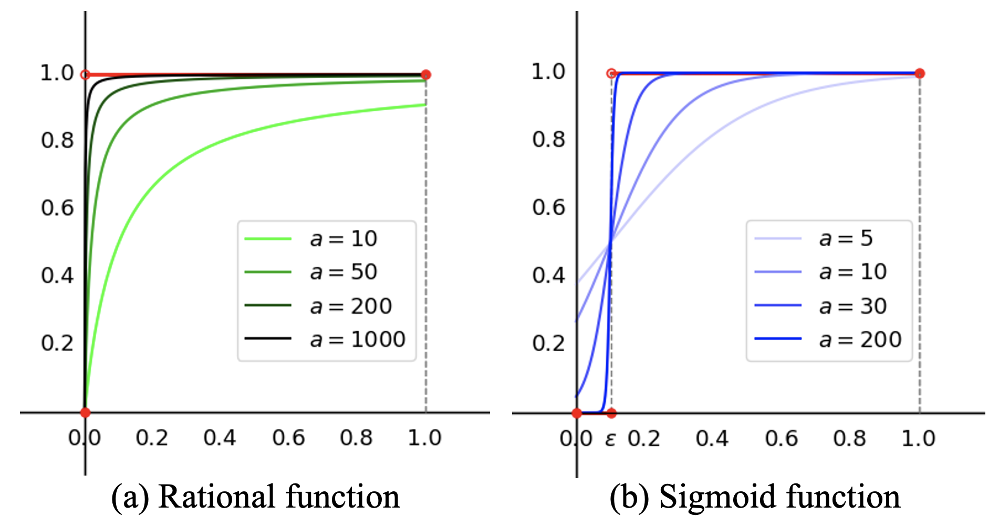
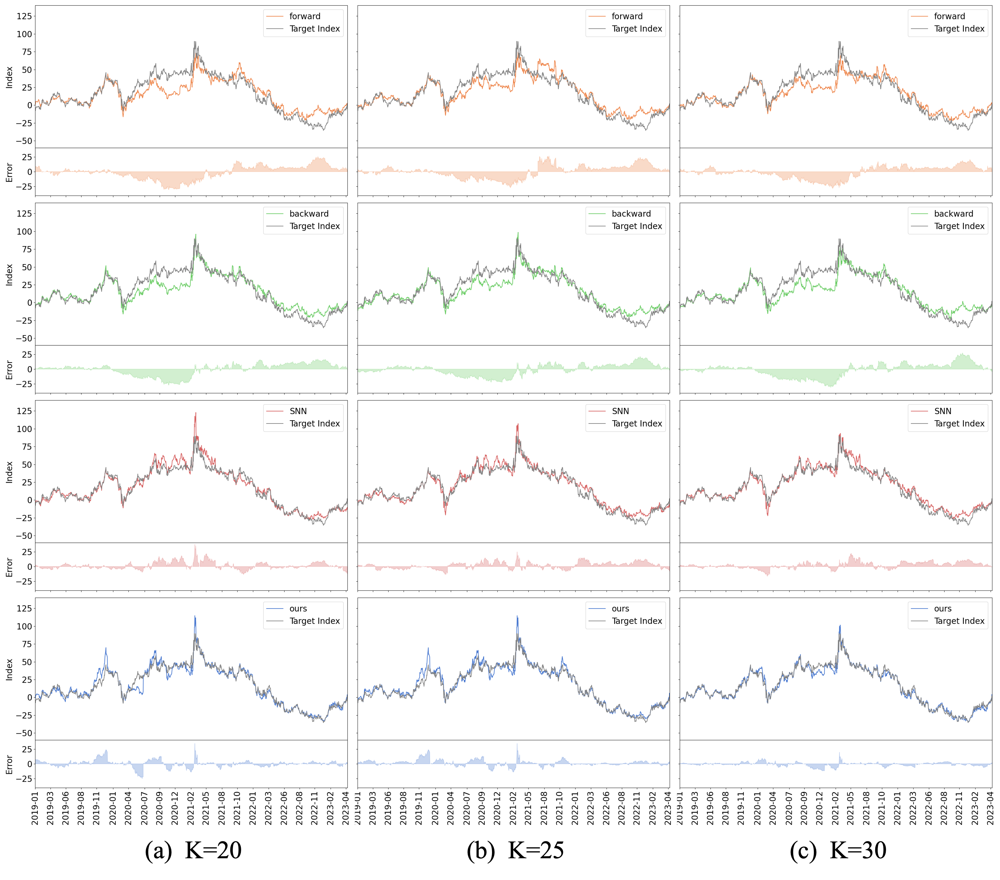
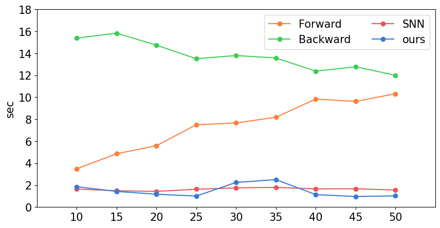
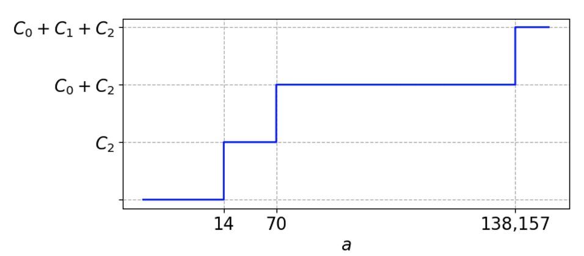

# **DCC: Differentiable Cardinality Constraints for Partial Index Tracking**

## **Overview**
This repository provides the implementation for **Differentiable Cardinality Constraints ($DCC$)** and its floating-point precision-aware variant **$DCC_{fpp}$**, introduced to tackle the NP-hard problem of partial index tracking in portfolio optimization. The proposed methods are designed to enforce cardinality constraints effectively while maintaining polynomial time complexity.

Key highlights of this work include:
- Transforming cardinality constraints into differentiable forms.
- Achieving superior performance in index tracking while adhering to cardinality constraints.
- Handling large datasets such as S&P 100, S&P 500, and KOSPI 100 efficiently.

<br>

**Note**: This work has been accepted as an Oral Presentation at the **AAAI Conference on Artificial Intelligence (AAAI), 2025**, one of the premier conferences in the field of Artificial Intelligence.

---

## **Research Summary**

### **Problem Statement**
Index tracking is a popular portfolio optimization strategy aimed at mimicking a market index's performance. However, full replication of an index leads to high transaction costs. Partial replication, which selects only a subset of stocks, introduces **cardinality constraints**, making the problem non-convex, non-differentiable, and NP-hard.

### **Proposed Solutions**
   <div style="text-align: center;">
      
   </div>

1. **Differentiable Cardinality Constraints ($DCC$)**:
   - A method to approximate cardinality constraints with differentiable functions, enabling integration with mathematical optimization techniques.
2. **$DCC_{fpp}$**:
   - An extension of $DCC$ to handle floating-point precision issues and ensure accurate cardinality enforcement.
3. **Theoretical Guarantees**:
   - Polynomial time complexity.
   - Accurate cardinality calculation and constraint satisfaction.

### **Experimental Results**
The proposed methods outperform traditional baselines (Forward Selection, Backward Selection) and state-of-the-art methods (SNN) in terms of:
- **Tracking Error**: Lower Mean Absolute Error (MAE).
- **Runtime**: Efficient computation with polynomial time complexity.

---

## **Code Features**
This repository includes:
- **Optimization Scripts**: Implements $DCC$ and $DCC_{fpp}$ using the Lagrangian multiplier method.
- **Dataset Handling**: Scripts to download and preprocess financial datasets.
- **Backtesting Support**: Evaluate the performance of optimized portfolios over time.
- **Visualization Tools**: Generate plots for tracking error.

---

## **Folder Structure**
```
.
├── data
│   ├── get_index_data.py
│   ├── get_sp100_data.py
│   ├── get_sp500_data.py
│
├── prafe
│   ├── universe.py
│   ├── utils.py
│   ├── portfolio.py
│   ├── evaluation.py
│   ├── lagrange_orig.py
│
├── main_lag.py
├── run.sh
```

---

## **Installation**
Clone the repository:
```bash
git clone https://github.com/qt5828/DCC_Differentiable_Cardinality_Constraints.git
cd DCC_Differentiable_Cardinality_Constraints
```

Install the required Python libraries:
```bash
pip install numpy pandas scipy matplotlib yfinance
```

---

## **Usage**
### **1. Run the Model**
Use the provided `run.sh` script to execute the optimization pipeline:
```bash
bash run.sh
```

### **2. Example Command**
```bash
python main_lag.py \
  --data_path 'financial_data' \ # name of data folder
  --result_path 'results' \
  --solution_name 'lagrange_ours' \ # DCC_fpp
  --cardinality 30 \ 
  --method 'SLSQP' \
  --start_date '2018-01-02' \
  --end_date '2023-04-28' \
  --index_type 's&p100' \
  --backtesting True \
  --month_increment 3 # rabalacing duration for backtesting 
```

### **3. Dataset Preparation**
Download historical stock data using the dataset scripts:
```bash
python get_index_data.py
python get_sp100_data.py 
python get_sp500_data.py
```

---

## **Code Explanation**
### **Key Files**

- **`main_lag.py`**: Main script for running optimization and backtesting.
- **`prafe/lagrange_orig.py`**: Implements $DCC_{fpp}$ using the Lagrangian multiplier method.
- **`data/get_index_data.py`**, **`data/get_sp100_data.py`**, **`data/get_sp500_data.py`**: Scripts to fetch and preprocess financial datasets.
- **`prafe/evaluation.py`**: Computes performance metrics such as tracking error, Sharpe ratio, and volatility.
- **`prafe/portfolio.py`**: Handles portfolio operations, including weight allocation and rebalancing.
- **`prafe/utils.py`**: Utility functions for data handling and visualization.
- **`prafe/universe.py`**: Manages stock universe for index tracking.

---

## **Experimental Results**
### **Tracking Performance**
The table below compares the Mean Absolute Error (MAE) for different methods:

| Method          | K=20  | K=25  | K=30  |
|------------------|-------|-------|-------|
| Forward Selection | 8.91  | 8.26  | 7.93  |
| Backward Selection| 7.73  | 7.59  | 8.66  |
| SNN              | 5.80  | 4.04  | 4.90  |
| **$DCC_{fpp}$**        | **3.91** | **3.53** | **2.39** |

<div style="text-align: center;">
      
</div>

### **Runtime Comparison**
$DCC_{fpp}$ demonstrates significantly lower runtime compared to baselines, maintaining efficiency regardless of the cardinality size ($K$).
   <div style="text-align: center;">
      
   </div>

### **Hyperparameter Analysis**:
   <div style="text-align: center;">
      
   </div>

---

## **Links**
- **[arXiv Paper](https://arxiv.org/abs/2412.17175)**: Access the full paper for detailed information.
- **[Repository](https://github.com/qt5828/DCC_Differentiable_Cardinality_Constraints)**: Explore the codebase.

---

## **References**
If you use this code or method in your research, please cite the following paper:
```bibtex
@misc{jo2024dccdifferentiablecardinalityconstraints,
      title={DCC: Differentiable Cardinality Constraints for Partial Index Tracking}, 
      author={Wooyeon Jo and Hyunsouk Cho},
      year={2024},
      eprint={2412.17175},
      archivePrefix={arXiv},
      primaryClass={cs.AI},
      url={https://arxiv.org/abs/2412.17175}, 
}
```

---

## **Contact**
For any questions or issues, please contact:
- **Wooyeon Jo**: [qt5828@ajou.ac.kr](mailto:qt5828@ajou.ac.kr)
- **Hyunsouk Cho**: [hyunsouk@ajou.ac.kr](mailto:hyunsouk@ajou.ac.kr)
---
